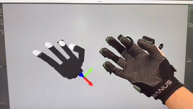

# Geometric Retargeting

[](https://creativecommons.org/licenses/by-nc/4.0/)

Welcome! This repository contains the code for the paper "Geometric Retargeting: A Principled, Ultrafast Neural Hand Retargeting Algorithm".



## Quick start: visualize a hand after cloning

The browser-based visualizer needs no display, no GPU, no SAPIEN — and (for the bundled
demos) **no torch**, so it runs on a plain MacBook:
```
git clone https://github.com/yijie21/GeoRT.git && cd GeoRT
pip install -e .                    # registers the package (no heavy deps)
pip install numpy viser yourdfpy    # the only deps the visualizer needs
python geort/env/hand_viser.py --hand wuji   # or: --hand allegro_right
```
Open the printed `http://localhost:8080` (forward the port first if on a remote box:
`ssh -L 8080:localhost:8080 <user>@<server>`). You get the hand with a slider per joint and
an "Animate" toggle. The 5-finger **Wuji** hand model is included (MIT license).

**Side-by-side comparison (also runs after clone).** A pretrained Wuji checkpoint and several
small demo sequences are bundled, so you can immediately see the MANO human hand and the
retargeted Wuji hand side by side. Pick a sequence with `-data`:
```
# MANO / FürElise demos
python geort/mocap/compare_viser.py -hand wuji -ckpt_tag wuji_mano -data furelise_demo    # piano motion
python geort/mocap/compare_viser.py -hand wuji -ckpt_tag wuji_mano -data mano_gesture      # finger-by-finger

# GRAB grasping demos (real human grasps)
python geort/mocap/compare_viser.py -hand wuji -ckpt_tag wuji_mano -data grab_s2_stapler   # stapling
python geort/mocap/compare_viser.py -hand wuji -ckpt_tag wuji_mano -data grab_mug_drink    # drinking from a mug
python geort/mocap/compare_viser.py -hand wuji -ckpt_tag wuji_mano -data grab_teapot_pour  # pouring a teapot
```
Left = MANO human mesh, right = Wuji driven by the trained model on the same frames. All of
these replay precomputed joint angles, so they run with no torch.

> **⚠️ The `grab_*` demos are GRAB data (non-commercial, no redistribution) and are bundled
> only because this repo is private — keep it private, see [DATA_NOTICE.md](./DATA_NOTICE.md).**

> **macOS / no-torch:** the bundled demos ship with the retargeted joint angles precomputed
> (`data/<name>_qpos.npy`), so `compare_viser` replays them with **no torch required** — only
> `numpy viser yourdfpy`. torch is needed only if you retarget your *own* new data (run the
> model); when CUDA is absent it automatically falls back to CPU.

> **Licensing of bundled data — please read [DATA_NOTICE.md](./DATA_NOTICE.md).** The demo
> data is non-commercial only (FürElise is CC BY-NC; the gesture is MANO-derived). The MANO
> models (`assets/mano_v1_2/`) and **GRAB** data are **not** redistributed here — their
> licenses forbid it. To make your own data (or use GRAB), obtain MANO and follow
> [Example: Virtual Data Collection with MANO](#example-virtual-data-collection-with-mano-wuji-hand).

## Installation
If you have already got a conda environment with torch, you just need these packages
```
pip install trimesh open3d "sapien>=2.2,<3" "setuptools<81" zmq
pip install -e .
```
> **Important:** GeoRT requires **SAPIEN 2.x** (not 3.x). SAPIEN 3.x renamed/removed the
> APIs used here and will fail with errors like
> `module 'sapien.core' has no attribute 'VulkanRenderer'`. The `setuptools<81` pin is
> needed because SAPIEN 2.x imports `pkg_resources`, which newer setuptools removed.
> See [Notes and Troubleshooting](#notes-and-troubleshooting).

Otherwise, we recommend using a virtual environment to install the required packages. To install the required packages, run the following command:
```
conda create --name geort python=3.8
pip install -r requirements.txt
pip install -e .
```
## Quick Overview
Upon completion, you will be able to train GeoRT and deploy the checkpoint in a clean and straightforward way. 
### Training (1-2min):
```
python ./geort/trainer.py -hand allegro_right -human_data human_alex -ckpt_tag geort_1
```
### Deploy in code
```
import geort
model = geort.load_model('geort_1')
mocap = ...
qpos = model.forward(mocap.get())
```
But before this, we need to complete some one-time system setup steps outlined below.

**Useful Links**: [Notes and Troubleshooting](#notes-and-troubleshooting)
## Getting Started
We use the native Allegro Hand as an example. 

### Step 1: Import your robot hand (one-time setup).
Note: For the Allegro Hand, you can actually skip this step. However, please follow it if you want to import a customized robot hand.

We just need to complete a quick setup process outlined below:

1. Place your robot hand URDF file in the ``assets`` folder. (We have included the Allegro example there.)
2. Create a config file named ``your_robot_name.json`` in the ``geort/config`` directory. Below is an example for the Allegro hand. For brevity, the details are omitted here, but you can refer to the [this](./geort/config/allegro_right.json) for full information. For setup instructions, please read [this](./geort/config/template.py).

```
{
    "name": "allegro_right",  
    "urdf_path": "./assets/allegro_right/allegro_hand_description_right.urdf",
    "base_link": "base_link",
    "joint_order": [
        "joint_0.0", "joint_1.0", "joint_2.0", "joint_3.0",
        "joint_4.0", "joint_5.0", "joint_6.0", "joint_7.0",
        "joint_8.0", "joint_9.0", "joint_10.0", "joint_11.0",
        "joint_12.0", "joint_13.0", "joint_14.0", "joint_15.0"
    ],
    "fingertip_link": [
        {
            "name": "index",
            "link": "link_4.0_tip",
            "joint": ["joint_0.0", "joint_1.0", "joint_2.0", "joint_3.0"],
            "center_offset": [0.0, 0.0, 0.0],
            "human_hand_id": 8,
        },
        ...
    ]
}

```
Now, you can run this command to visualize your hand.
```
python geort/env/hand.py --hand [YOUR_HAND_CONFIG_NAME]
```
such as 
```
python geort/env/hand.py --hand allegro_right
```
<span style="color:red"> If there is any segmentation error, please simplify the collision meshes or just remove all the `<collision>` fields in your URDF. </span> See the [Notes and Troubleshooting](#notes-and-troubleshooting) section.

> **Note:** This command opens an interactive SAPIEN viewer window and therefore needs a
> display. On a headless machine (no `DISPLAY`, e.g. a remote server), use `ssh -X` /
> VNC, or skip this visualization step entirely — it is only a sanity check and the rest
> of GeoRT (training, deployment, kinematics) works headless.

### Step 2: Collect human hand mocap data.
Now we need to collect some human hand data for training the retargeting model. We put an example human recording dataset in data folder. You can add your own data to that folder and here is a template python script to do this.

```
import geort
import time

# Dataset Name
data_output_name = "human" # TODO(): Specify a name for this (e.g. your name)

# Your data collection loop.
mocap = YourAwesomeMocap() # TODO(): your mocap system.
                           # Define a mocap.get() method.
                           # Apologies, you still have to do this...
 
data = []

for step in range(5000):       # collect 5000 data points.
    hand_keypoint = mocap.get() # mocap.get() return [N, 3] numpy array.
    data.append(hand_keypoint)
    
    time.sleep(0.01)            # take a short break.

# finish data collection.
geort.save_human_data(data, data_output_name)
```
Use ``geort.save_human_data`` API -- this can simplify your effort in specifying the path. This dataset can be reloaded later using **data_output_name**. 

During the data collection process, try to 1. fully stretch each finger and explore its fingertip moving range and 2. perform pinch grasps. Ensure that your fingers feel natural and comfortable—since during teleoperation deployment, you will use these recorded gestures to control the robot! Please avoid any unnatural or strained movements.

> **No mocap device? Sample virtual data with MANO.** Instead of recording a real hand, you can synthesize the training data from the MANO hand model. GeoRT's trainer only consumes the 5 fingertips as per-finger workspace point clouds, so well-distributed MANO samples are a drop-in replacement. See [Example: Virtual Data Collection with MANO (Wuji hand)](#example-virtual-data-collection-with-mano-wuji-hand) for a complete, runnable pipeline.

We understand that most users likely have their own mocap systems. However, for demonstration purposes, we provide a simple mocap solution based on MediaPipe. Please note, this is intended only for demo use and not for deployment; we will explain this in more detail later.

```
python ./geort/mocap/mediapipe_mocap.py --name human
```
to generate a dataset named ``human``. Refered to the file for instructions. When you see the pop-up window, press ``s`` to start recording and ``q`` to finish. 

**Note:** Please ensure that the hand frame orientation is consistent between your motion capture system and the hand URDF (but fortunately the origin does not require any alignment and you can just set it to palm center). In our provided mocap example, we support the **right** hand using the following convention:+Y axis: from the palm center to the thumb. +Z axis: from the palm center to the middle fingertip. +X axis: palm normal (pointing out of the palm). 

### Step 3: Train the Model
Assuming you have placed ``your_robot_name.json`` in the ``geort/config`` folder as described in Step 1, and set ``data_output_name`` to ``human`` in Step 2, run the following command. TAG is the checkpoint id to use in later deployment.

```
python ./geort/trainer.py -hand your_robot_name -human_data human -ckpt_tag TAG
```

Let it train for about 30–50 epochs (approximately 1–2 minutes). You can press Ctrl+C to stop early if you wish. 

If this is the first time you’re training for a new hand, an additional 5 minutes will be needed to train the neural FK model — this only happens once.
In the command above, 

For demo purpose, we have put ``human_alex.npy`` data in the ``data`` folder. For adapting it to a right Allegro hand, just run

```
python ./geort/trainer.py -hand allegro_right -human_data human_alex -ckpt_tag geort_1
```
This will generate a checkpoint named ``geort_1``. Later you can call ``model = geort.load_model('geort_1')`` to use it in your code.

### Step 4: Deploy!
Ok, now we are all set. Use the following code to import and deploy the trained model. 

```
import geort

checkpoint_tag = 'geort_1'          # TODO: your checkpoint name, assume it is 'TAG'
model = geort.load_model(checkpoint_tag, epoch=50)  # set epoch=-1 to use the last model.

mocap = YourAwesomeMocap()      # TODO: your mocap.
robot = YourRobustRobotHand()   # TODO: your robot.

while True:
    qpos = model.forward(mocap.get()) # This is the retargeted qpos. 
                                      # (Note: unnormalized joint angle)
    robot.command(qpos)               # execute!

```
We provide some examples in ``geort/mocap/mediapipe_evaluation.py`` and ``geort/mocap/replay_evaluation``. If you have manus glove, you can also refer to ``geort/mocap/manus_evaluation.py``. We recommend (insist) you use a glove-based mocap system instead of MediaPipe, as for vision-based mocap there is significant input distribution shift during deployment!

The simplest way for testing is to use the replay evaluation as below. This will show the retargeted trajectory in the viewer. 
```
python ./geort/mocap/replay_evaluation.py -hand allegro_right -ckpt_tag YOUR_CKPT -data YOUR_TRAINING_DATA
```
For instance, if we have ``human.npy`` in the ``data`` folder
```
python ./geort/mocap/replay_evaluation.py -hand allegro_right -ckpt_tag YOUR_CKPT -data human
```

**Headless server?** ``replay_evaluation.py`` opens the native SAPIEN viewer, which needs a display. Use the browser-based equivalent instead — it renders the same retargeted trajectory in a web page via [viser](https://github.com/nerfstudio-project/viser) and overlays the human target fingertips so you can see the tracking quality:
```
python ./geort/mocap/replay_viser.py -hand wuji -ckpt_tag YOUR_CKPT -data YOUR_TRAINING_DATA
```
Then forward the port from your laptop (``ssh -L 8080:localhost:8080 <user>@<server>``) and open ``http://localhost:8080``. The same approach is available for plain hand visualization via ``geort/env/hand_viser.py``.

## Example: Virtual Data Collection with MANO (Wuji hand)

This is an end-to-end worked example of the four steps above for a custom hand (the 5-finger **Wuji** hand), using **MANO-sampled** data in place of a real mocap recording. It runs fully headless.

**Why this works.** GeoRT's trainer reads only the 5 fingertips from the ``[T, 21, 3]`` data, turns each finger into a voxel-resampled point cloud, and resamples each finger *independently* — so what matters is fingertip **workspace coverage** (and overlap between fingers, which gives the pinch loss something to act on), not real recorded trajectories. Broadly-sampled MANO poses provide exactly that.

### 1. One isolated env for MANO sampling

MANO sampling needs ``manopth`` + ``chumpy``, and ``chumpy`` is incompatible with NumPy ≥ 1.24. Keep it in a **separate** conda env so it cannot disturb your ``geort`` env:
```
conda create -n mano python=3.9 -y
conda activate mano
pip install "numpy==1.23.5" "scipy<1.11" "opencv-python-headless==4.8.1.78"
pip install torch --index-url https://download.pytorch.org/whl/cpu   # CPU is enough for sampling
pip install --no-build-isolation chumpy                              # --no-build-isolation: chumpy's setup imports pip
pip install "git+https://github.com/hassony2/manopth.git"
```
> Do not loosely ``pip install`` more packages into this env afterwards — pulling in ``numpy>=2`` will silently break ``chumpy``.

Place the MANO models (``MANO_RIGHT.pkl`` / ``MANO_LEFT.pkl``) under ``assets/mano_v1_2/models`` (the default search path).

### 2. Sample the data

```
conda activate mano
python geort/mocap/mano_mocap.py --name mano_right --n_samples 8000 --pca_std 2.0
```
This writes ``data/mano_right.npy`` of shape ``[T, 21, 3]`` in meters, MediaPipe layout (fingertips at indices 4/8/12/16/20), already rotated into GeoRT's palm-frame convention (+Y → thumb, +Z → middle, +X → palm normal). It prints workspace-extent and pinch-overlap stats so you can sanity-check coverage. Increase ``--pca_std`` or ``--n_samples`` for wider coverage / more thumb opposition.

### 3. Set up the Wuji config and check frame alignment

``geort/config/wuji.json`` points at ``assets/wuji/urdf/right_nocollision.urdf`` (collision meshes removed to avoid load-time segfaults — see Troubleshooting). The Chamfer loss compares the human cloud directly against the robot fingertip cloud in the URDF ``base_link`` frame, so the two frames must agree. Verify it:
```
conda activate geort
python geort/mocap/check_alignment.py --hand wuji --human mano_right
```
A green verdict means the palm-normal axis and the thumb direction match; otherwise add a virtual base link to the URDF (the script tells you how).

### 4. Train, then evaluate headless

```
conda activate geort
python geort/trainer.py -hand wuji -human_data mano_right -ckpt_tag wuji_mano
python geort/mocap/replay_viser.py -hand wuji -ckpt_tag wuji_mano -data mano_right
```
Deploy exactly as in Step 4 above: ``model = geort.load_model('wuji_mano', epoch=-1)``.

### 5. Side-by-side gesture comparison (visual sanity check)

To see at a glance whether the robot reproduces a human gesture, render the MANO hand and the retargeted robot hand next to each other. First generate a legible gesture sequence (curl each finger in turn, then a fist) in the `mano` env — this also saves the MANO mesh:
```
conda activate mano
python geort/mocap/mano_gesture.py --name mano_gesture
```
Then play both hands side by side in the browser (`geort` env):
```
conda activate geort
python geort/mocap/compare_viser.py -hand wuji -ckpt_tag wuji_mano -data mano_gesture
```
The left hand is the MANO human mesh; the right hand is the robot driven by the trained model on the same frames. When MANO curls one finger, the corresponding robot finger should curl and the others stay still; at the fist, all curl together.

### 6. Replay real motion-capture sequences (FürElise / GRAB)

For natural, recognizable motion instead of synthetic gestures, convert a real MANO-pose **sequence** dataset and feed it to the same `compare_viser.py`.

**FürElise** ([rcwang/for_elise](https://huggingface.co/datasets/rcwang/for_elise)) — piano-playing hand motion; per piece it ships precomputed MANO joints + verts, so no `mano` env is needed. The full set is one 47 GB zip, so `furelise_fetch.py` streams just one piece via HTTP range requests:
```
conda activate geort
python geort/mocap/furelise_fetch.py --piece 65 --out hf_datasets/furelise/065     # ~133 MB
python geort/mocap/furelise_to_geort.py --pkl hf_datasets/furelise/065/motion.pkl --hand right --name furelise_65
python geort/mocap/compare_viser.py -hand wuji -ckpt_tag wuji_mano -data furelise_65
```

**GRAB** ([grab.is.tue.mpg.de](https://grab.is.tue.mpg.de)) — whole-body object grasping; stores per-frame MANO parameters, so conversion runs in the `mano` env via manopth. GRAB needs a free licensed account; data is split per subject (`grab__s1.zip` … `grab__s10.zip`, ~260–660 MB each), each holding ~90 `s<N>/<object>_<action>.npz` sequences. After downloading a subject zip and extracting a sequence:
```
conda activate mano
python geort/mocap/grab_to_geort.py --npz <grab>/s2/stapler_staple_1.npz --hand right --name grab_demo
conda activate geort
python geort/mocap/compare_viser.py -hand wuji -ckpt_tag wuji_mano -data grab_demo
```
The adapter reads the per-frame `fullpose` (45-d axis-angle) and reconstructs the mesh with manopth (mean shape).

Both adapters re-express each frame in its palm frame (removing the global hand motion) and emit `data/<name>.npy` + `data/<name>_mano.npz`, exactly what `compare_viser.py` expects. Downloaded datasets live under `hf_datasets/` (a symlink to a larger storage volume).

### 7. Quality gate: is the sample + training enough?

`eval_retarget.py` turns the retargeting into pass/fail metrics and tells you **whether to collect more data or train more**:
```
conda activate geort
python geort/mocap/eval_retarget.py -hand wuji -ckpt_tag wuji_mano \
    --train_data mano_right --eval_data furelise_65,grab_s2_stapler
```
It reports four things and a verdict:
- **Neural-FK accuracy** (training) — the FK surrogate the IK trained against, in mm.
- **Coverage** (data) — nearest-neighbor distance from each deployment fingertip to the training cloud; large ⇒ deployment is out-of-distribution ⇒ **collect more samples** (it names the under-covered fingers).
- **Direction consistency** (training) — moving a human fingertip moves the robot fingertip the same way (cosine, measured in-distribution); low ⇒ **train more / tune**.
- **Pinch fidelity** (training) — robot tip gap when human tips touch.

The verdict separates the two axes: coverage BAD → more data; training BAD on covered data → more epochs/tuning; both → fix data first. Pass your real deployment datasets via `--eval_data` so coverage is actually checked.

## Real-time hand retargeting from your camera (live demo)

Drive the Wuji hand in real time from your webcam or an Intel RealSense camera: MediaPipe
detects your hand, GeoRT retargets it, and the robot mirrors your fingers in the browser —
your detected hand on the left (rendered as a solid **hand model**), the robot on the right.

The left-hand model is the camera's detected pose drawn as a mesh (sphere joints + cylinder
bones — MediaPipe outputs 21 keypoints, not a mesh of its own). This lets you **localize
errors**: if the left hand looks wrong/jittery, it's a *detection* problem (camera/MediaPipe);
if the left hand looks correct but the robot doesn't match it, it's a *retargeting* problem.
For the most direct detection check, add `--show_camera` to see MediaPipe's landmarks overlaid
on the live camera image.

### Requirements
```
pip install mediapipe opencv-python viser yourdfpy torch   # core live-demo deps
pip install pyrealsense2                                    # only for a RealSense camera
```
Notes:
- The MediaPipe model `hand_landmarker.task` ships in the repo root (the demo loads it by
  relative path, so run the command from the repo root).
- `mediapipe` may require `numpy<2`. If that clashes with another env, make a dedicated env
  for the live demo (it only needs the packages above + `pip install -e .`; no SAPIEN/GPU).
- On Linux, grant the terminal access to the camera; `/dev/video*` for the webcam, and the
  RealSense udev rules for the RealSense.

### Run it
```
# built-in laptop webcam
python geort/mocap/live_camera_viser.py -hand wuji -ckpt_tag wuji_mano --camera webcam

# Intel RealSense
python geort/mocap/live_camera_viser.py -hand wuji -ckpt_tag wuji_mano --camera realsense

# no camera — sanity-check the viewer/pipeline by replaying bundled data
python geort/mocap/live_camera_viser.py -hand wuji -ckpt_tag wuji_mano --replay mano_gesture
```
Open `http://localhost:8080` (forward the port if remote). Show your **right** hand; add
`--mirror` if the robot is flipped, `--show_camera` to pop up the annotated camera view, and
`--smooth 0.3` for more/less temporal smoothing (lower = smoother but laggier). The hand pose
is canonicalized to the palm frame and auto-scaled, so position/orientation/distance to the
camera don't matter — only your finger articulation does. Use `--hand_viz skeleton` for a
lighter lines-only rendering on slower machines (the default `mesh` is the solid hand model).

### Getting the best quality (recommended)
The bundled `wuji_mano` checkpoint was trained on **MANO** data, while a webcam has different
noise/scale — so out of the box expect some jitter and imperfect mapping (vision mocap is
demo-grade; a glove is cleaner). For a clean result, follow GeoRT's intended workflow: collect
a few thousand frames of *your own* hand with the same MediaPipe pipeline, then retrain:
```
python geort/mocap/mediapipe_mocap.py --name my_hand      # press s/e/q to record (needs RealSense; see file)
python geort/trainer.py -hand wuji -human_data my_hand -ckpt_tag wuji_live
python geort/mocap/live_camera_viser.py -hand wuji -ckpt_tag wuji_live --camera webcam
```
Now train and deploy distributions match, which removes most of the shift.

## Contributing
Feel free to contribute your robot model and mocap system to the GeoRT repository!

## [Notes and Troubleshooting](#notes-and-troubleshooting)
1. **Note:Joint Range Clipping.** One core assumption of GeoRT is that the motion range of robot fingertips resembles that of human hands. To maintain realistic fingertip poses, please clip your robot's joint movement ranges appropriately and avoid unnatural configurations.

2. **Simulation Errors with New Hands?** Simulation errors (segmentation fault) may occur when importing new robotic hands (e.g. [this issue](https://github.com/facebookresearch/GeoRT/issues/7)), and this is usually caused by collision meshes. To avoid this, ensure that the collision meshes defined in your URDF are simple—such as boxes or basic convex shapes. Alternatively, you can remove all <collision> elements from the URDF to eliminate these issues entirely. 

3. **Hand Coordinate System (Frame) Convention** Please ensure that the hand frame orientation is consistent between your motion capture system and the hand URDF (but fortunately the origin does not require any alignment and you can just set it to palm center). In our provided mocap example, we support the **right** hand using the following convention:+Y axis: from the palm center to the thumb. +Z axis: from the palm center to the middle fingertip. +X axis: palm normal (pointing out of the palm). 

4. **SAPIEN version error (`module 'sapien.core' has no attribute 'VulkanRenderer'`).** This means SAPIEN 3.x is installed. GeoRT uses the SAPIEN 2.x API. Fix with:
   ```
   pip install "sapien>=2.2,<3" "setuptools<81"
   ```
   The `setuptools<81` pin is required because SAPIEN 2.x imports `pkg_resources` at startup (`ModuleNotFoundError: No module named 'pkg_resources'` otherwise).

5. **Running on a headless server (no display).** Commands that open the SAPIEN viewer (`geort/env/hand.py`, `replay_evaluation.py`, the MediaPipe scripts) require a display. Either connect with X11 forwarding (`ssh -X`) / VNC, or use the browser-based viser equivalents (`geort/env/hand_viser.py` for visualization, `geort/mocap/replay_viser.py` for evaluation), which need no display. Training and deployment do not need a display either.

6. **Segmentation fault during training / keypoint computation (some multi-finger hands).** SAPIEN 2.x's built-in pinocchio forward-kinematics binding can crash on certain valid URDFs (it surfaces as a segfault the first time `keypoint_from_qpos` runs, e.g. while generating the robot kinematics dataset). `geort/env/hand.py` therefore computes fingertip keypoints with SAPIEN's *native* articulation FK (`set_qpos` + link `get_pose`, which is pure kinematics) instead of pinocchio. This is automatic; no action is needed, but it is worth knowing if you compare against upstream GeoRT.


## Contact Us
For any inquiries, please open an issue or contact the authors via email at ``zhaohengyin@cs.berkeley.edu``
<!-- ## Bibliography -->

## License
CC-by-NC license


